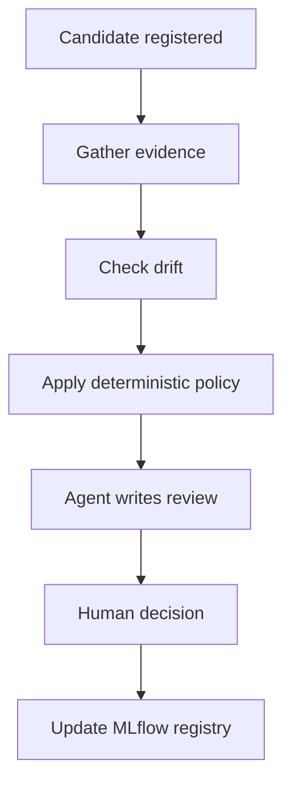

import BlogPostLayout from '../../components/BlogPostLayout'
import { createBlogStaticProps } from '../../lib/getPostWordCount'

export const meta = {
  slug: 'agentic-mlops-review-flow-april-2026',
  title: 'What Building an Agentic MLOps Review Flow in an Isolated Environment Taught Me',
  date: '2026-04-05',
  summary:
    'After building a ReAct-style model promotion review system for HDB resale price prediction, the hardest part was not adding the agent, it was making it trustworthy in an isolated enterprise environment where bad decisions have real business cost.',
  tags: ['MLOps', 'AI', 'LangGraph', 'agentic', 'machine-learning'],
  mediumUrl: '',
}

export const getStaticProps = createBlogStaticProps(meta.slug)

export default function Page({ children, wordCount }) {
  return <BlogPostLayout meta={meta} wordCount={wordCount}>{children}</BlogPostLayout>
}

When people write about agentic systems, they usually start with capability. Give an LLM some tools, let it search for context, let it call APIs, and the workflow suddenly looks smarter. After building one inside an isolated enterprise setup, I came away caring much less about raw capability and much more about trust.

The hard part was never adding the agent. The hard part was making the agent trustworthy in an environment where systems are isolated, dependencies fail in awkward ways, and a bad decision has a real business cost.

I ran into that while building an HDB resale price prediction project with an agentic promotion review flow. Once a candidate model is registered, something has to decide whether it is safe to replace the current champion. That is where I used an agentic workflow. The enterprise path runs on my own MLOps platform, MAESTRO. The public repo ships the local/Colab workflow plus the shared package modules, while the enterprise notebook variants stay private.

The open-source repo is here: [github.com/tengfone/hdb-resale-agentic-mlops](https://github.com/tengfone/hdb-resale-agentic-mlops).

## The Shape of the System

I never wanted the agent to train the model or decide whether a model should be promoted. I wanted it in the review layer.

The workflow has three parts. First, deterministic code gathers evidence, compares the candidate to the current champion, checks for drift, and applies policy. Second, a ReAct-style explainer agent investigates the evidence with a constrained toolset and writes a structured report. Third, a human reviewer makes the final call whenever promotion is still on the table.



In my case, the candidate comes from an HDB resale price model. I evaluate overall RMSE and MAE, but I also track segment performance by town and flat type because an average improvement can still hide a harmful regression. The promotion workflow is orchestrated with LangGraph, the evidence and decisions are recorded in MLflow, and the review packet is persisted so the decision stays auditable and resumable.

## How I Got Here

This was not the first version I had in mind.

My first instinct was the obvious version. Train the model, hand the metrics and some context to an LLM, let it investigate, and ask it whether the candidate should be promoted. It looks clean on a whiteboard, and it is close to how many agentic demos are presented. The problem is that model promotion is not a summarization task. It is a control point.

Three things pushed me away from that design.

First, I needed the final decision to be explainable in business terms, not just technically plausible. If a model is promoted, I need to know which thresholds passed, which checks failed, and who signed off. Second, I was building for an isolated environment, which means tool availability is never something I can take for granted. A model review flow that works only when every API, provider, and network path is healthy is not really a review flow. Third, once I started thinking about drift, subgroup regressions, and audit history, it became obvious that I did not want those rules hidden inside prompt behavior.

That is what led me to the current split. Deterministic code owns policy and routing. The agent owns investigation and explanation. The human owns the final approval when promotion is still possible. The system got a bit more complex, but it also got much easier to defend.

## Why I Kept the Agent Out of the Final Decision

This is still the most important design call in the whole workflow.

LLMs are useful when the job is to synthesize evidence, explain tradeoffs, and pull together context from multiple tools. They are much less trustworthy when the job is to own the final promote or reject decision for a live model. Promotion is a control point. It affects production behavior, business risk, and how easy it will be to explain the change later.

So in my workflow, the policy engine decides the routing first. It produces a deterministic verdict such as `PROMOTE`, `MANUAL_REVIEW`, or `REJECT` based on explicit checks. Only after that does the explainer agent get involved. The agent can inspect candidate metrics, champion comparisons, drift results, training history, and optional market research. It can decide which tools to call and how to structure the explanation. What it cannot do is override the policy logic.

From a business perspective, this separation felt much more honest. I do not want a persuasive paragraph to quietly outrank a hard regression threshold. I want the agent to help a reviewer understand what is going on, not to inherit authority that should belong to deterministic policy or a human owner.

There is one nuance here. For obvious rejects, the workflow can reject automatically after the report is generated. Even then, I still persist the review packet so a human can inspect it later and override if needed. That gives me a useful middle ground.

I also wanted that boundary to be visible in code, not just in architecture diagrams. The ordering below is the important part. The policy verdict is computed before the explainer runs, and only non-reject cases move to human review.

```python
def apply_policy(state: PromotionState) -> dict:
    verdict = evaluate_policy(
        candidate_metrics=state["candidate_metrics"],
        comparison=state["comparison"],
        drift_report=_drift_report_from_dict(state.get("drift_report")),
        evidence_errors=list(state.get("evidence_errors", [])),
    )
    return {"policy_verdict": verdict}


def route_after_report(state: PromotionState) -> str:
    if state["policy_verdict"].decision == PolicyDecision.REJECT:
        return "execute_decision"
    return "human_review"
```

That may look simple, but that simplicity is doing real work. It means the agent never quietly becomes the decision-maker just because it produced a convincing explanation.

## What Breaks First in an Isolated Environment

The first thing that breaks is usually not the model. It is the assumption that your AI tooling will be available wherever the real workflow has to run.

In a normal development environment, it is easy to wire up an LLM, search provider, notebook, and registry client and convince yourself the pattern works. In an isolated enterprise environment, moving those capabilities closer to the workload is a project in itself. You either invest in a workflow that can run those tools inside the constrained environment, or you invest in a developer setup that can faithfully replicate enough of it to be useful. Without that, the agentic part stays theatrical.

External search is a good example. People often talk about LLMs that can search the internet or an intranet faster than a human and pull in richer context. That is directionally true, but operationally incomplete. In a real isolated setup, the agent might not have the right network path, the result set might be stale, the provider response shape might be slightly incompatible, or the API might simply be unavailable.

That is why I stopped thinking of tool access as a feature checklist and started treating it as a reliability problem. If the LLM path is unavailable, the workflow falls back to a deterministic template report built from the same evidence. If market research is unavailable, the review proceeds without pretending that research happened. If MLflow review persistence fails while tracking is configured, the workflow blocks instead of silently degrading. In MLOps, silent success is often worse than loud failure.

## A Failure Mode That Changed My Design

One of the biggest mindset shifts for me was realizing that fallback and fail-closed behavior need different treatment.

If the LLM is unavailable, I still want the workflow to produce a usable review packet. The agent is helping with explanation, so that can degrade gracefully. If review persistence fails, I do not want the workflow to continue as though nothing happened. At that point I am losing auditability at exactly the step where auditability matters.

That distinction ended up showing up directly in code:

```python
if not os.environ.get("OPENAI_API_KEY"):
    fallback_note = (
        "OPENAI_API_KEY not set. Used the template-based report instead."
    )
    report_text = _generate_template_report(...)

review_logged = log_promotion_review_artifacts(...)
if _mlflow_tracking_is_configured() and not review_logged:
    raise PromotionReviewPersistenceError(
        "Promotion review artifacts could not be persisted to MLflow."
    )
```

This is the kind of detail that changed how I think about agentic systems in enterprise settings. Not every failure should stop the workflow. Not every failure should be tolerated either. You have to decide which missing capability is merely inconvenient and which one breaks the trust contract.

## A Concrete Review Walkthrough

One of the most useful scenarios I keep around is a candidate that looks acceptable at the top level but fails when you inspect one segment closely.

In that scenario, the current champion has an RMSE of 150,000 and the candidate comes in at 155,000. That is worse, but not catastrophically worse. It is a 3.3 percent regression, which is still below the hard overall regression threshold. Drift is also clean in that run, so if I only looked at overall metrics and drift, the candidate might look like a borderline but manageable case.

The problem shows up when the workflow compares segment performance. For the town segment `YISHUN`, the candidate RMSE jumps from 150,000 for the champion to 195,000 for the candidate. That is a 30 percent regression for that subgroup. In my policy, segment regressions above 20 percent do not auto-reject the model, but they do force `MANUAL_REVIEW`.

That is exactly the kind of case I wanted this system to catch. If I only optimized for aggregate metrics, I could easily end up promoting a model that is slightly acceptable on average while getting noticeably worse for one part of the population. In a business setting, that is not a math curiosity. That is a real regression.

Here is how that run behaves:

1. Candidate metrics are loaded and compared to the current champion.
2. Drift checks run and come back clean.
3. Segment deltas show `town=YISHUN (+30.0%)`.
4. The deterministic policy returns `MANUAL_REVIEW`.
5. The agent writes a report that highlights the subgroup regression and its likely impact.
6. A human reviewer decides whether this is an acceptable tradeoff or a reason to keep the current champion.

I like this example because it shows why I did not want the agentic layer to own the promotion decision. The agent can help explain why Yishun got worse and whether there is any surrounding market context worth inspecting, but it should not get to decide that a 30 percent subgroup regression is acceptable. That is a policy question and, after policy has spoken, a human accountability question.

I also keep scenarios like this as fixtures for tests and demos. That turned out to be important. It means the same cases I use to explain the workflow to humans are also the cases I use to verify the routing logic, the report generation, and the review behavior. For agentic systems, that kind of reuse is valuable because it ties the narrative back to something concrete and repeatable.

## Why Observability Matters More Than Extra Tool Calls

The more agentic a workflow becomes, the more debugging moves from code inspection into behavioral inspection. It is no longer enough to know that the notebook completed. You need to know what evidence the agent saw, which tools it called, what came back, whether it used a fallback path, and how the final decision was recorded.

I ended up caring a lot more about review packets, traces, version tags, and reproducible scenarios than I expected. Each promotion review is persisted locally and mirrored into MLflow. Decision metadata is written back to the model version. The explainer path records structured outputs and trace information. There is also an optional LLM judge that scores the report quality, but that judge is advisory only. I did not want one LLM grading another and then quietly nudging promotion policy.

The first is drift. In my workflow, categorical drift is checked with PSI and numeric drift with KS tests. Drift does not force an immediate permanent reject, but it does block automatic promotion and routes the candidate into manual review. That is an example of where the deterministic layer should stay in charge. Drift is not a storytelling problem. It is a control problem.

The second is segment regression. Suppose the overall error looks slightly better, but one flat type or one town gets materially worse. That is exactly the kind of failure that an average metric can hide and a business team will care about. I push those segment metrics through the entire workflow so the policy engine can force manual review when a subgroup regresses. Then the agent can help explain why the regression matters and whether there is any surrounding context worth considering.

Without observability, both of those cases become harder to trust. You end up reading a nice report without knowing whether it is grounded in the right facts.

I found it useful to ask a simple question: after a bad promotion review, what would I want to inspect first. At minimum, I want a persisted record that looks something like this:

```json
{
  "policy_verdict": "MANUAL_REVIEW",
  "policy_reasons": "Data drift detected in: town, floor_area_sqm",
  "decision_source": "human_review",
  "decision_timestamp": "2026-04-04T09:41:12Z",
  "decision_reviewer": "analyst@example"
}
```

That example is small on purpose. If I cannot answer those questions quickly, I do not really have an operational review system. I just have an agent that wrote a nice report.

## Where the Agentic Patterns Actually Helped

Three patterns ended up being worth keeping.

The first was deterministic orchestration. LangGraph gave me a clear state machine for gather evidence, check drift, apply policy, generate report, and then either stop for human input or execute the final registry action.

The second was a single ReAct investigator. Once the policy verdict and evidence existed, the agent was good at turning metrics, segment deltas, drift results, training history, and optional market context into a readable review.

The third was human in the loop. Human review is there because promotion is a business decision with technical evidence attached to it. If a model is going to replace the current champion, somebody should be accountable for saying yes.

What did not help was pretending that agentic patterns should spread everywhere. I do not think every MLOps step needs an agent. Deterministic thresholding, drift checks, artifact persistence, and registry mutation are exactly the places where I want boring code.

## What I Would Recommend to Teams Trying This

Start from the business decision, not the agent. In my case, the question was simple: should this candidate replace the current champion. Once I framed it that way, the boundaries got clearer. Hard policy checks became deterministic. Narrative explanation became a good fit for the agent. Final ownership stayed with a human.

Design the fallback path before you celebrate the happy path. If the LLM disappears, your workflow should still produce something useful. If a provider returns malformed output, you should know that happened. If a required evidence artifact is missing, promotion should stop. Agentic systems fail in messy ways, so fallback behavior is part of the product, not an edge case.

Invest in observability earlier than feels necessary. Teams often want better prompts, more tools, or a stronger model. Those can help, but they do not solve the trust problem. Persist the review packet. Record the tool outputs. Tag the final decision. Keep model version history clean. Test scenario fixtures that represent real promotion states.

Keep the agent on a short leash and be honest about maintenance cost. Bound the tool surface. Make the control flow explicit. Do not let the agent mutate production state just because it can produce convincing text. The more fancy tooling you add, the harder debugging becomes. Someone still has to maintain the surrounding system, monitor provider health, inspect regressions, and keep the review logic aligned with the business.

## Closing Thoughts

I still think agentic AI has real potential in MLOps. It can help teams scale review and make complex model changes easier to understand. But I came away from this project believing that the operational layer matters more than the agent layer.

Model versioning matters more once an agent enters the loop because you need a durable record of what changed and why. Drift detection matters more because an articulate explanation does not make a shifted distribution safe. Human review matters more because somebody has to own the decision when a model crosses the line into production.

If you want the short version, mine is this: use agents where they genuinely improve investigation, context gathering, and explanation. Keep deterministic code in charge of policy and control points. Build for failure before you build for fluency.

The private MAESTRO-specific notebook variants are staying private, but the public repo still reflects the core ideas. The local/Colab notebook and the shared package modules preserve the same promotion design, the same agent boundary, and the same bias toward auditability and fallbacks. Internal enterprise users can layer the MAESTRO-specific entrypoints on top of that shared core. That is the part worth reusing. Not the exact platform, but the discipline around where the agent fits.
